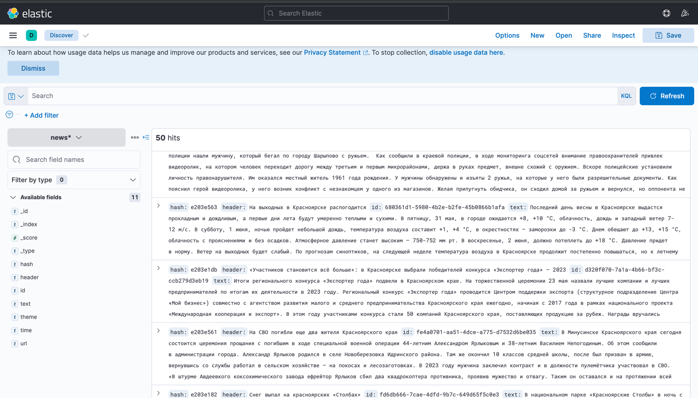
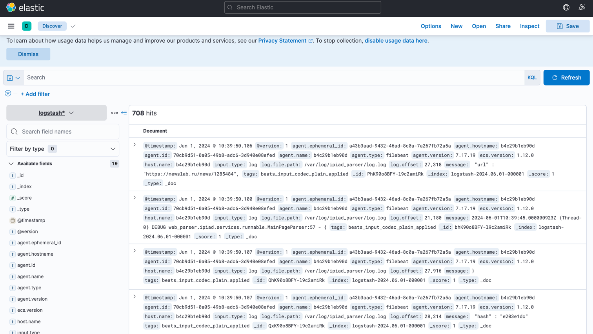

# Java Web Crawler

## Stack

- Java 21
- ELK 7.17.19 (elasticsearch lib 8.8.0)
- RabbitMQ 5.20.0 (lib)
- Jsoup 1.10.2 (lib)

### Поднять окружение с помощью docker-compose
```
docker-compose -f docker-data/docker-compose.yml up -d
```

### Stop
```
docker-compose -f docker-data/docker-compose.yml down
```

### ElasticSearch
Созданы 2 индекса: news (полученные в результате парсинга новости) и logstash* (индекс созданный логстэшем для хранения логов, ротация происходит по дням и индексы нумеруются после достижения предельного количества записей в нем)

Поэтому в Kibana необходимо создать 2 Index Pattern'а чтобы посмотреть содержимое:

News:


Logstash:


### RabbitMQ


### О программе
Происходит парсинг сайта https://newslab.ru/news

Сначала извлекаются ссылки на новостные посты на главной странице, ссылки кладутся в rabbitmq в канал для ссылок, 
затем эти ссылки вычитываюстся с помощью basicComsume сервисом NewsParser (2 инстанса), страница скачивается и парсится
новость после парсинга кладется в отдельный канал для распаршенных новостей

Затем новость вычитыается сервисом NewsLoader с помощью basicGet (решение менее оптимальное так как использут технологию поллинга) и затем новость кладется в elasticsearch по индексу:


```
elasticClient.indices().create(c -> c.index(indexName).mappings(m -> m
        .properties("id", p -> p.text(d -> d.fielddata(true)))
        .properties("header", p -> p.text(d -> d.fielddata(true)))
        .properties("text", p -> p.text(d -> d.fielddata(true)))
        .properties("URL", p -> p.text(d -> d.fielddata(true)))
        .properties("theme", p -> p.text(d -> d.fielddata(true)))
        .properties("time", p -> p.text(d -> d.fielddata(true)))
        .properties("hash", p -> p.text(d -> d.fielddata(true)))
));
```

Появление логов (добавление данных в файл) фиксируется сервисом filebeat, который отправляет их в logstash, далее логи пишутся в elactic по индексам вида: logstash-2024.05.27-000001

# Queries and Aggregations
### 1. OR Query
```
POST /news/_search
{
  "query": {
    "bool": {
      "should": [
        {"match": {"time": "31 мая"}},
        {"match": {"text": "Красноярска"}}
       ]
    }
  }
}
```

### 2. AND Query
```
POST /news/_search
{
  "query": {
    "bool": {
      "must": [
        {"match": {"time": "31 мая"}},
        {"match": {"text": "Красноярск"}}
       ]
    }
  }
}
```

### Script Query
```
POST /news/_search
{
  "query": {
    "script_score": {
      "query": {"match_all": {}},
      "script": {
        "source": "return doc['text'].value.length() "
      }
    }
  }
}
```


### MultiGet Query
```
GET /news/_mget
{
  "docs": [
    { "_id": "8xK90o8BFY-l9c2amCPg" },
    { "_id": "8hK90o8BFY-l9c2amCN9" }
  ]
}
```

### Histogram Aggregation
```
POST /news/_search
{
  "aggs": {
    "header_length_histogram": {
      "histogram": {
        "script": {
          "source": "doc['header'].value.length()",
          "lang": "painless"
        },
        "interval": 1
      }
    }
  }
}
```

### Terms Aggregation
```
POST /news/_search
{
  "aggs": {
    "themes": {
      "terms": {
        "field": "theme"
      }
    }
  }
}
```

### Filter Aggregation
```
POST /news/_search
{
  "aggs": {
    "filtered_body": {
      "filter": {
        "term": {"theme": "туризм"}
      },
      "aggs": {
        "avg_summary_length": {
          "avg": {
            "script": {
              "source": "doc['text'].value.length()",
              "lang": "painless"
            }
          }
        }
      }
    }
  }
}
```

